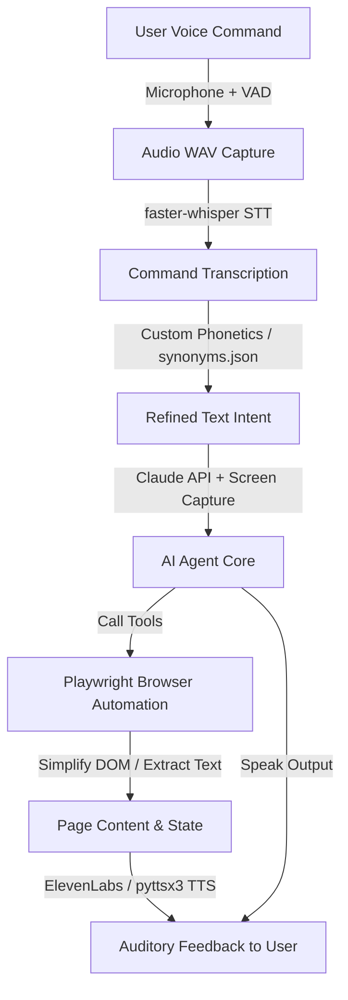

# NetEye — AI-Powered Voice Web Navigator
> An Intelligent, Voice-Controlled Web Navigation Assistant for Visually Impaired and Blind Users.
> **PAP 2025–2026 · Herik Braga · Student No. 7**

---


## 👁️ Overview

**NetEye** is an advanced assistive technology application designed to democratize web browsing for blind and visually impaired individuals. By leveraging state-of-the-art Voice Activity Detection (VAD), Speech-to-Text (STT) models, Large Language Models (LLM) with Computer Vision fallbacks, and Text-to-Speech (TTS) engines, NetEye enables users to completely control and browse the web using natural voice commands.

The assistant acts autonomously, simplifying the DOM tree, handling cookies, dismissing modals silently, and describing web pages dynamically to provide a seamless, non-intrusive auditory browsing experience.

---

## ✨ Key Features

- **🗣️ Natural Voice Control & Wake Word**: Listens passively using a dedicated Wake Word ("*Ei NetEye*") with a microphone-triggered listener powered by `webrtcvad`.
- **🧠 Cognitive AI Agent (Claude)**: Powered by Anthropic's Claude API, the system intelligently interprets user intents, uses tools to execute operations, and processes screenshot elements to understand page contexts visually.
- **⚡ High-Performance Local STT**: Employs `faster-whisper` for lightning-fast offline speech-to-text transcription with custom phonetic dictionary matching (`synonyms.json`).
- **🎙️ Expressive TTS & Offline Fallback**: Features high-fidelity streaming voice synthesis with ElevenLabs, reverting to a robust local `pyttsx3` engine if offline or if API quotas are exhausted.
- **🌐 Web Administration Dashboard**: Built on Flask, providing a clean user interface for managing profiles, history, bookmarks, shortcut commands, and monitoring real-time backend logs.
- **🛡️ Silent Cookie/Modal Resolution**: Automatically blocks cookie banners, newsletters, and pop-up modals to keep the browsing flow clean.
- **📦 Web Installer & Auto-Updater**: Packaged with a bootstrapper setup executable that downloads updates automatically from GitHub Releases.

---

## 🏗️ Architecture Flow



---

## 📋 Prerequisites

Before setting up NetEye, ensure you have:
- **Windows 10 or 11 (64-bit)**
- **Python 3.11 or higher** (Ensure you check **"Add Python to PATH"** during installation)
- **Git** (optional, for repository management)
- **Anthropic API Key** (Required for the Claude cognitive assistant)
- **ElevenLabs API Key** (Optional, for premium voice synthesis)

---

## 🚀 Installation & Setup

Follow these steps to run NetEye locally from source:

### 1. Clone the Repository
Open Command Prompt (`cmd`) and navigate to your directory of choice, then run:
```cmd
git clone https://github.com/bragaa10/NETEYE-AI.git
cd NetEyeAI
```

### 2. Set Up Virtual Environment
Create and activate a virtual environment to manage project packages:
```cmd
python -m venv venv
venv\Scripts\activate
```
*(You should see `(venv)` prepended to your command prompt line).*

### 3. Install Project Dependencies
Install all required python modules listed in `requirements.txt`:
```cmd
pip install -r requirements.txt
```
> ⏳ *Note: This step may take a few minutes as it installs heavy libraries for voice recognition and machine learning.*

### 4. Download Natural Language Model
Install the Portuguese language model for spaCy NLP parsing:
```cmd
python -m spacy download pt_core_news_sm
```

### 5. Install Playwright Web Engines
Install the necessary Chromium binary for browser automation:
```cmd
playwright install chromium
```

### 6. Set Up Environment Variables (Claude API Key)
NetEye requires an Anthropic API Key. You can get one from the [Anthropic Console](https://console.anthropic.com/).

#### Option A: Session Scope (Command Prompt)
```cmd
set ANTHROPIC_API_KEY=sk-ant-api03-XXXXXXXXX
```

#### Option B: Persistent System Scope (Recommended)
1. Press `Windows + S`, search for "Environment Variables", and click **Edit the system environment variables**.
2. Click the **Environment Variables...** button.
3. Under **User variables**, click **New...**.
4. Name the variable `ANTHROPIC_API_KEY` and set the value to your secret key.
5. Click **OK** to save.

---

## 🎮 How to Use

### Launching the Assistant (Terminal Mode)

You can launch NetEye directly from your command line:

* **Standard Mode (Voice + Browser)**:
  ```cmd
  python main.py
  ```
* **Inject API Key Directly**:
  ```cmd
  python main.py --chave-api YOUR_API_KEY_HERE
  ```
* **Text-Only Command Line (No Microphone)**:
  ```cmd
  python main.py --texto
  ```
* **Headless Browser (Hidden Window)**:
  ```cmd
  python main.py --headless
  ```
* **Voice-Only Output (No Browser automation)**:
  ```cmd
  python main.py --sem-browser
  ```

### Launching the Web Management Dashboard

To run the system via the Web Admin GUI, start the Flask server:
```cmd
python app.py
```
Then, open your web browser and navigate to `http://127.0.0.1:5000` to access configuration, voice history, bookmarks, and user profiles.

---

## 🎙️ Voice Command Reference

*Note: Since the assistant targets Portuguese users, the default voice triggers are in Portuguese. Below is the reference translation.*

### 🗺️ Navigation Commands
| Voice Command (PT) | English Translation | Action Performed |
|---|---|---|
| "Abre o Google" | "Open Google" | Navigates the browser to google.com |
| "Vai para youtube.com" | "Go to youtube.com" | Navigates the browser to YouTube |
| "Volta atrás" | "Go back" | Performs a back navigation step |
| "Avança" | "Go forward" | Performs a forward navigation step |
| "Nova aba" | "New tab" | Opens a new browsing tab |

### 🔍 Search & Forms
| Voice Command (PT) | English Translation | Action Performed |
|---|---|---|
| "Pesquisa por [termo]" | "Search for [term]" | Conducts a Google search for the specified term |
| "Procura notícias" | "Search for news" | Searches Google for general news |
| "Escreve [texto]" | "Write [text]" | Enters text into the currently focused input field |
| "Clica em [nome]" | "Click on [name]" | Clicks the button/link matching the specified name |

### 📖 Reading & Accessibility
| Voice Command (PT) | English Translation | Action Performed |
|---|---|---|
| "Lê a página" | "Read page" | Parses and reads aloud the main content of the web page |
| "O que está aqui?" | "What is here?" | Gives a summary description of the page elements |
| "Descreve a página" | "Describe the page" | Provides a detailed auditory description of the page layout |
| "Sobe a página" / "Desce" | "Scroll up" / "Scroll down" | Scrolls the web page up or down |

### 🔖 System Control & Bookmarks
| Voice Command (PT) | English Translation | Action Performed |
|---|---|---|
| "Adiciona aos favoritos" | "Add to bookmarks" | Saves the current page URL to the local bookmarks database |
| "Os meus favoritos" | "My bookmarks" | Reads aloud the list of saved bookmarks |
| "Para" / "Silêncio" | "Stop" / "Silence" | Immediately stops the current text-to-speech output |
| "Repete" | "Repeat" | Replays the last spoken response |
| "Ajuda" | "Help" | Reads the built-in voice command manual |

---

## ⚙️ Advanced Configuration

System settings are managed in `config/settings.yaml`. You can customize speech voices, speech models, and performance parameters:

```yaml
assistente:
  nome: "NetEye"
  idioma: "pt-PT"
  voz_tts: "pt-PT-DuarteNeural"     # Edge-TTS voice identifier
  velocidade: 1.15                 # Voice speed rate multiplier
  volume: 1.0                      # Output volume (0.0 to 1.0)

stt:
  modelo_whisper: "base"           # Whisper models: tiny | base | small | medium
  idioma_whisper: "pt"             # Whisper transcription input language
  dispositivo: "cpu"                # Execution device: cpu | cuda (requires NVIDIA GPU)

vad:
  aggressividade: 1                # Voice Activity Detection sensitivity (0 to 3)
  silencio_para_processar: 0.45    # Seconds of silence required before processing
  tempo_minimo_fala: 0.3           # Ignores short noises below this duration

browser:
  modo_headless: false             # Hide browser window if set to true
  timeout_pagina: 5                # Seconds allowed before page load timeout
```

---

## 📂 Project Directory Structure

```text
NetEyeAI/
├── config/
│   └── settings.yaml      # Configuration files (TTS, STT, VAD, and Browser profiles)
├── core/
│   ├── assistant.py       # Claude LLM API & agent tool-execution logic
│   ├── browser.py         # Playwright Chromium controller & DOM interaction layer
│   ├── database.py        # SQLite user session, configuration, & bookmark persistence
│   ├── listener.py        # Audio capturing stream with WebRTC Voice Activity Detection (VAD)
│   ├── transcriber.py     # Local Whisper model transcriber (faster-whisper)
│   └── eleven_speaker.py  # ElevenLabs high-quality TTS voice synthesizer
├── data/
│   ├── NetEye.db          # Auto-generated SQLite Database file
│   └── synonyms.json      # Voice phonetics replacement map for STT correction
├── gui/                   # GUI resources and interface windows
├── static/                # Web dashboard assets (logos, styles, icons)
├── templates/             # HTML templates for the Flask Admin interface
├── app.py                 # Flask server application script
├── build_installer.py     # Packager script for generating standalone setup executables
├── installer_gui.py       # Customtkinter Web Bootstrapper source
├── main.py                # Main application entry point
├── requirements.txt       # Python environment dependencies list
├── LICENSE                # Proprietary license agreement
└── README.md              # Project manual documentation
```

---

## 🛠️ Built With

| Framework / Library | Purpose |
|---|---|
| **Python** | Central language engine |
| **OpenAI Whisper** | High-precision Speech-to-Text translation (STT) |
| **ElevenLabs API** | Natural, human-like voice synthesis (TTS) |
| **Playwright** | Full browser automation and page manipulation |
| **Anthropic Claude API** | Deep semantic reasoning and command execution |
| **SQLite & Flask** | Local persistence, user accounts, and web administration panel |
| **webrtcvad** | Hardware microphone audio silence filtering |

---

## 🎓 Academic Context & License

This application is developed in the scope of the **Professional Aptitude Project (PAP)** (*Prova de Aptidão Profissional*) for the Professional Course of Informatics at the academic year **2025–2026**.

* **Author**: Herik Braga
* **Student ID**: No. 7
* **Objective**: Enhance digital accessibility by enabling blind and visually impaired users to browse the web with absolute comfort using a conversational, tool-equipped AI agent.

### License
**Copyright © 2025-2026 Herik Braga. All Rights Reserved.**
This software is proprietary. Unauthorized copying, distribution, modification, or commercial exploitation of this program, via any medium, is strictly prohibited. For licensing inquiries, please contact the author.
